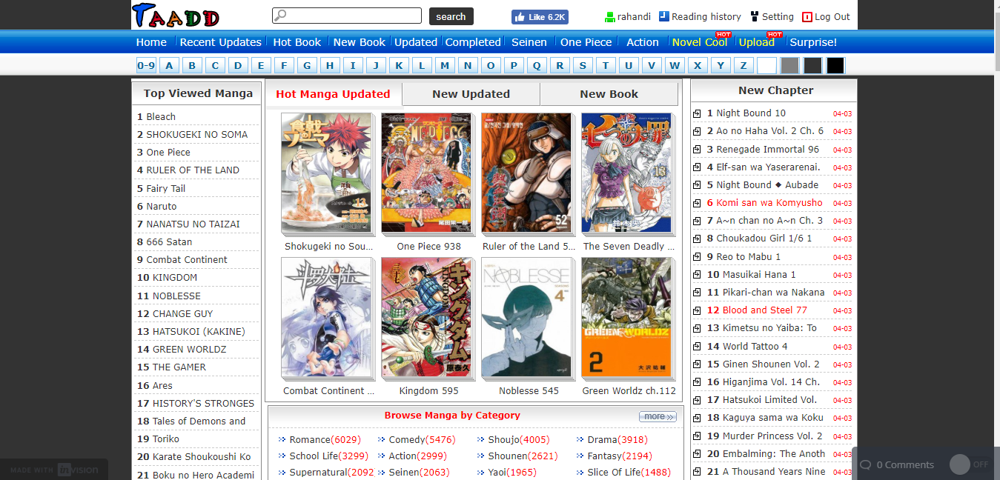
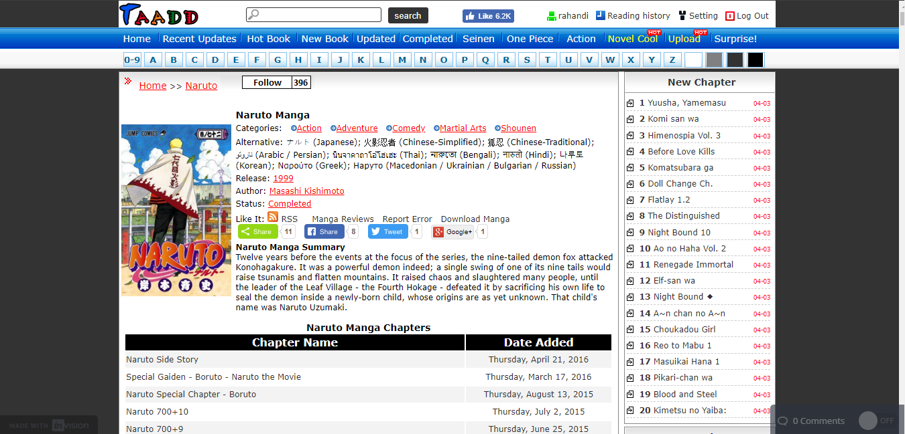
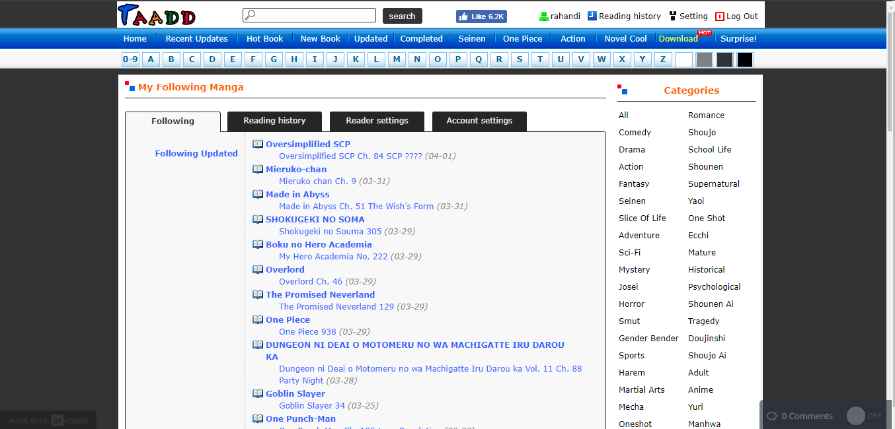

# Usability Evaluation and Prototyping (again)

## Operating the Prototype

https://www.youtube.com/embed/ttSbEDzVXSw

---

## Part A: Usability Evaluation

### 1. Brief Description of Participants

#### a. Description of Participant 1
- A girl, about 20 years old
- A student
- Only use laptop and internet for doing assignment

#### b. Description of Participant 2
- A boy, about 20 years old
- A student
- Only use laptop and internet for doing assignment and playing games

### 2. Evaluation Script
1. Open naruto manga page
1. Follow naruto manga
3. Unfollow naruto manga

### 3. Transcript

#### a. Transcript with Participant 1
1. me: ini prototype buat mengatasi masalah-masalah yang kemarin
1. her: oke
1. me: hal yang dilakukan masih sama kaya kemarin
1. her: oke
1. me: pertama, coba buka manga naruto
1. her: hmmmm..... (she clicked on naruto manga on the homepage)
1. me: okesip, terus coba follow manga naruto
1. her: (she clicked on follow button) tombol follownya lebih bagus daripada yang kemarin, tapi sepertinya tombol follow seharusnya ga disana, aku ga bakal ngerti ada fungsi buat follow kalau ga kamu omongin buat ngefollow manga
1. me: terus bagusnya gimana?
1. her: harusnya ada keterangan "follow this manga" terus dibawahnya baru ada tombol follow dan peletakannya yang lebih strategis lagi
1. me: okok
1. her: terus ngapain lagi?
1. me: terus coba unfollow manga naruto
1. her: (she clicked on unfollow button) penambahan dan pengurangan jumlah follower berfungsi, ga kayak kemaren, kalau kemarin kan di unfollow tapi jumlah followernya tetep
1. me: yawes, selesai, makasih ya
1. her: oke

#### b. Transcript with Participant 2

### 4. Feedback and Incidence Analysis

#### OBSERVATION 1

 - **Reference**: 
 - **Feedback**: 
 - **Incidence**: 
 - **Resolution**: 
 
#### OBSERVATION 2

 - **Reference**: Participant 1 (8)
 - **Feedback**: negative
 - **Incidence**: 
 - **Reason**: the 'follow' button position is not strategic enough for user to notice it
 - **Resolution**: move the 'follow' button to more strategic place and put some text over it.
 
#### OBSERVATION 3

 - **Reference**:  
 - **Feedback**: 
 - **Incidence**: 
 - **Reason**: 
 - **Resolution**: 

## Part B: Prototyping (again)
> Next, you will need to modify your prototype 
> based on the resolutions you have suggested in `Feedback and Incidence Analysis`'s observations.

### Sketch
> Draw a sketch of your prototype that is refined based according to the aforementioned observations on a paper.
> Afterwards, scan the sketch or make the photograph of it and attach it on this report's section.
> Please make sure the any texts on the sketch are readable.

### Design Rationale
> Please write a paragraph expressing what you have learned from the usability evaluation, 
> and how it is reflected in your design.

### High-Fidelity Interactive-Prototype
> Create a high-fidelity interactive-prototype based on the `Sketch` you have drawn.
> You can use any prototyping tools: InVision, Adobe XD, or even Microsoft PowerPoint.
